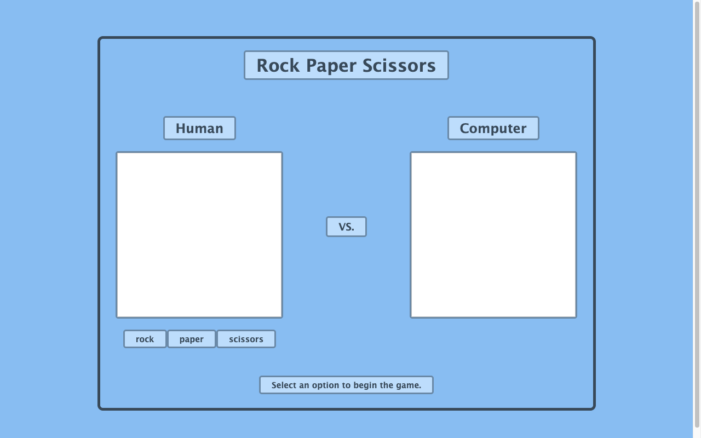

# Rock Paper Scissors

A browser Rock-Paper-Scissors game (player vs. computer) built to learn the **basics of
JavaScript — specifically functions** and DOM updates.

🔗 **Live demo:** [rock-paper-scissors-jet-mu.vercel.app](https://rock-paper-scissors-jet-mu.vercel.app/)



## Features

- Player choice buttons for rock, paper, and scissors.
- Randomized computer selection each round.
- Round comparison logic with score tracking.
- Visual choices and win/lose/tie feedback in the browser.

## Tech stack

Vanilla JavaScript · HTML · CSS (no build step)

## Getting started

Open `index.html` directly, or serve the folder:

```bash
npx serve .
```

## What I practiced

Writing **functions** to model game rules, generating randomized choices, and updating
the DOM to reflect each round's result.

## License

Odin Project coursework — original implementation by Aziz Umarov.
